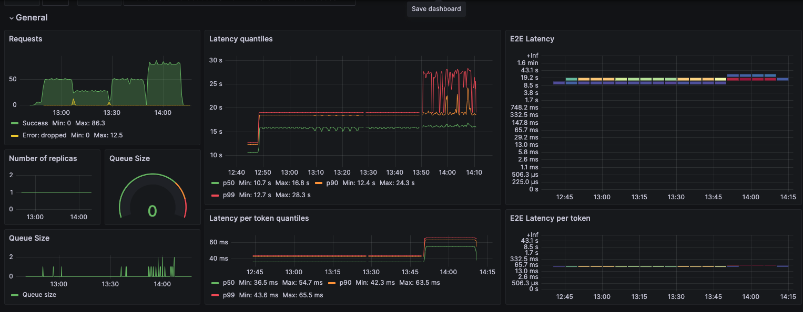

## TGI Monitoring using Self Managed Prometheus and Grafana
1. TGI metrics are exposed on /metrics path. Refer https://huggingface.github.io/text-generation-inference/. /metrics is the Prometheus metrics scrape endpoint
2. You need a prometheus server to scrape the metrics.
3. Run an EC2 server. Install Prometheus. 
```shell
wget https://github.com/prometheus/prometheus/releases/download/v2.26.0/prometheus-2.26.0.linux-amd64.tar.gz
tar -xvf prometheus-2.26.0.linux-amd64.tar.gz
sudo cp prometheus-2.26.0.linux-amd64/prometheus /usr/local/bin/
```
4. Create a scrape configuration. Following is the sample. `10.2.15.131` is private IP of TGI server. 
```yaml
global:
  scrape_interval: 15s
  external_labels:
    monitor: 'prometheus'

scrape_configs:
  - job_name: 'prometheus'
    static_configs:
      - targets: ['10.2.15.131:8080']

```
5. Run the prometheus server. This will push the metrics to AWS Managed Prometheus.
```shell
prometheus --config.file=prometheus.yaml &
```
6. Run Grafana on same EC2 or a different one.
```shell
docker run -d -p 3000:3000 --name=grafana -e "GF_INSTALL_PLUGINS=grafana-clock-panel" grafana/grafana
```
7. Add Prometheus server created above as data source. 
8. Import dashboard https://grafana.com/grafana/dashboards/19831-text-generation-inference-dashboard/. 
9. Sample dashboard 

## TGI Monitoring using AWS Managed Prometheus
1. You need a prometheus server to scrape the metrics. Refer https://aws.amazon.com/blogs/opensource/using-amazon-managed-service-for-prometheus-to-monitor-ec2-environments/
2. Create an IAM role for EC2. Assign this role AmazonPrometheusRemoteWriteAccess policy. 
3. Install prometheus and run following scrap config to push to Managed Prometheus. `10.2.15.131` is private IP of TGI server.
```yaml
global:
  scrape_interval: 15s
  external_labels:
    monitor: 'prometheus'

scrape_configs:
  - job_name: 'prometheus'
    static_configs:
      - targets: ['10.2.15.131:8080']

remote_write:
  -
    url: https://aps-workspaces.<region>.amazonaws.com/workspaces/<workspace>/api/v1/remote_write
    queue_config:
        max_samples_per_send: 1000
        max_shards: 200
        capacity: 2500
    sigv4:
        region: <region>
```

